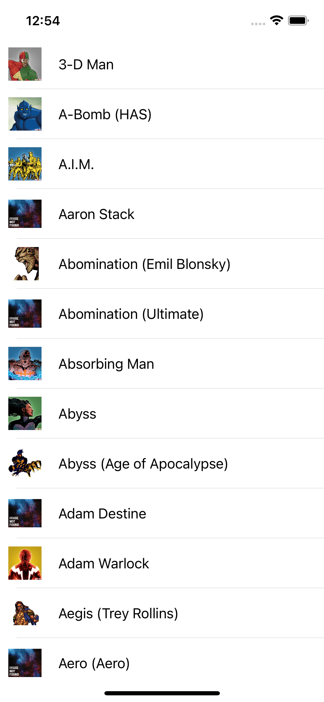
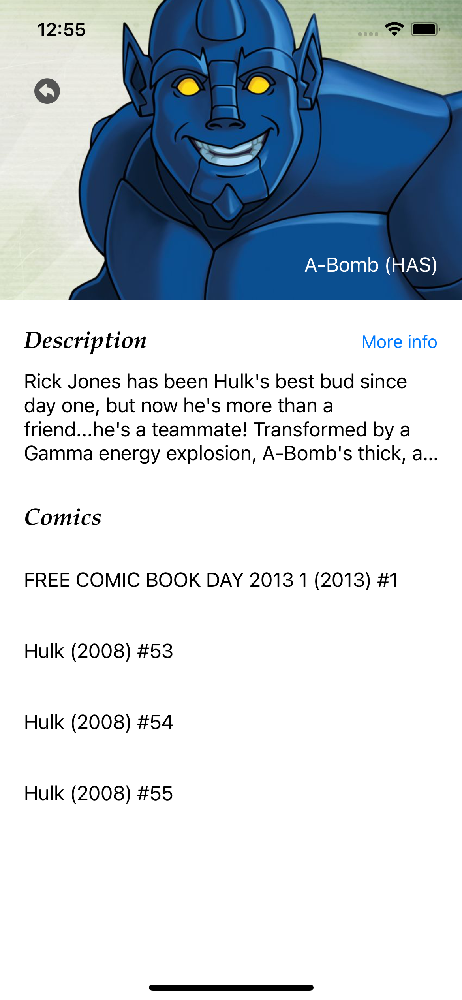

# MarvelHeroesApp

Marvel app with code testing from MarvelAPI

## Project info
* Xcode 12.5.1
* Swift 5
* VIPER Architecture
* Cocoapods

## Architecture: VIPER
VIPER is an application of Clean Architecture to iOS apps. The word VIPER is an acronym for View, Interactor, Presenter, Entity, and Routing. Clean Architecture divides an app’s logical structure into distinct layers of responsibility. This makes it easier to isolate dependencies (e.g. your database) and to test the interactions at the boundaries between layers.

## Cocoapods
You specify the dependencies for your project in a simple text file: your Podfile. CocoaPods recursively resolves dependencies between libraries, fetches source code for all dependencies, and creates and maintains an Xcode workspace to build your project. The latest released Xcode versions and the prior version are supported.

### 3rd Party Frameworks used

* Alamofire
* Lottie

## APIClient
Class with functions that retrieve data from Marvel's API
[(API)](https://developer.marvel.com/docs)

## How to run
Follow this simple steps for launch project:

* Clone the project
* Add pods for project with "pod install" or "pod update" if needed
* Put your api keys in the environment variables created at Scheme arguments
  * Go to schemes, MarvelHeroesApp, and clic on edit scheme
    
    
    
  * Edit the environment variables into Run option -> Arguments -> Environment Variables
  
    
    
* Run the project with MarvelHeroesApp app target

### Features
Marvel App with a list of heroes:
* When the user scrolls down it brings new data from server
* Detail of the hero including description, name, photo, comics and web link for more info
* Implemented tests for home module
* Error message with surprise!

## Screenshots
* Main

* Detail

## Meta

Ángel Luis Bayón Romero - [LinkedIn](https://www.linkedin.com/in/angel-bay%C3%B3n-romero-73282013a/)
